[toc]

#### Table of Content

[Unit 1 Internet and IP](#unit-1-internet-and-ip)

- [The 4 Layer Internet Model](#the-4-layer-internet-model)
- [The IP Service](#the-ip-service)
   - [What's in a Datagram](#whats-in-a-datagram)
- [Life of a Packet](#life-of-a-packet)
   - [TCP Byte Stream](#tcp-byte-stream)
   - [Inside the Stream](#inside-the-stream)
   - [The tools](#the-tools)
- [Principle: Packet Switching](#principle-packet-switching)
   - [No Per-Flow State Required: Simple Packet Forwarding](#no-per-flow-state-required-simple-packet-forwarding)
   - [Efficient Sharing of Links](#efficient-sharing-of-links)
- [Principle: Layering](#principle-layering)
   - [Definition](#definition)
   - [Reasons for Layering](#reasons-for-layering)
     - [It helps](#it-helps)
     - [Summary](#summary)
- [Principle: Encapsulation](#principle-encapsulation)
   - [Definition](#definition)
   - [Encapsulation Flexibility](#encapsulation-flexibility)
   - [Reason for Encapsulation](#reason-for-capsulation)
- [Memory, Byte Order, and Packet Formats](#memory-byte-order-and-packet-formats)
- [Names and Addresses: IPv4](#names-and-addresses-ipv4)
   - [Address Format](#address-format)
   - [Historical Address Structure](#address-address-structure)
   - [Today's Address Structure](#todays-address-structure)
   - [IPv4 Address Assignment](#ipv4-address-assignment)
- [Longest Prefix Match](#longest-prefix-match)

# Unit 1 Internet and IP

The Internet dominant model is **a bidirectional, reliable byte stream.**
Three networked applications:

- World Wide Web(HTTP): client-server model
- BitTorrent: peer-to-peer model, *client - Tracker - other clients*
- Skype: Mix of the both, *depends on if Skype clients can directly communication*

## The 4 Layer Internet Model

Data be sent by unit packets.

The network-layered **packet** be drawn as datagram, containing **data, source, and destination.** Source and destination info part is called **header.**

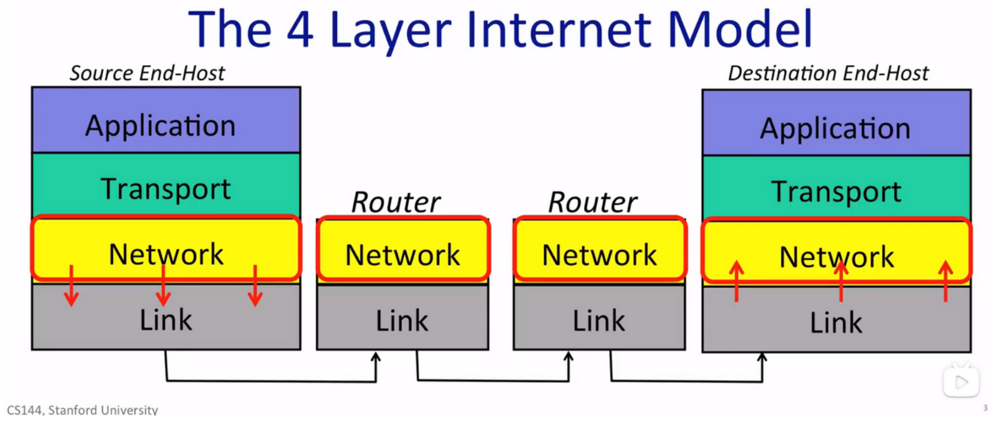

We use the Internet Protocol(IP) as a must:

- IP makes a best effort attempt to deliver datagrams, but no promises.
- IP datagrams can be lost, delivered out of order, corrupted, no guarantees.
- To deal with the unpraised issued the other protocol on the top of IP needed in Transport Layer (i.e., Transmission Control Protocol).

TCP:

- In Transport Layer
- Makes sure that all data packets delivered **correctly, in order,  to right place.**

UDP (User Datagram Protocol):

- Also in Transport Layer
- Does **not guarantee** the correct deliver, no repetition, in order. But **higher efficiency**.

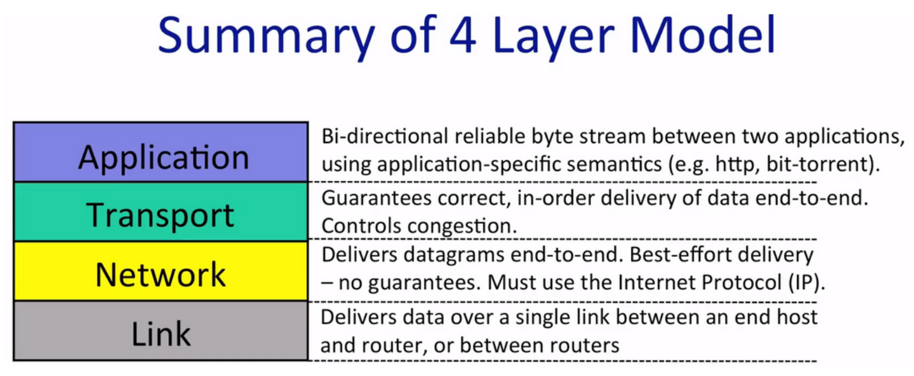

IP is called “thin waist”, for there are many choices on the top and under the Network Layer, but in Network Layer IP is the only choice.

| Application Layer:                                           | Transport Layer:                                             | Network Layer:                                               |
| ------------------------------------------------------------ | ------------------------------------------------------------ | ------------------------------------------------------------ |
| HTTP: <br/>- Generate request message according to target web server.<br/>- Process the requested content. | TCP:<br/>- Divided the HTTP message into segments, in sequence. Then pass them reliably.<br/>- Receive the segments and re-structure the segments in sequence. | IP:<br/>- Searching for target address, passing while routing. |

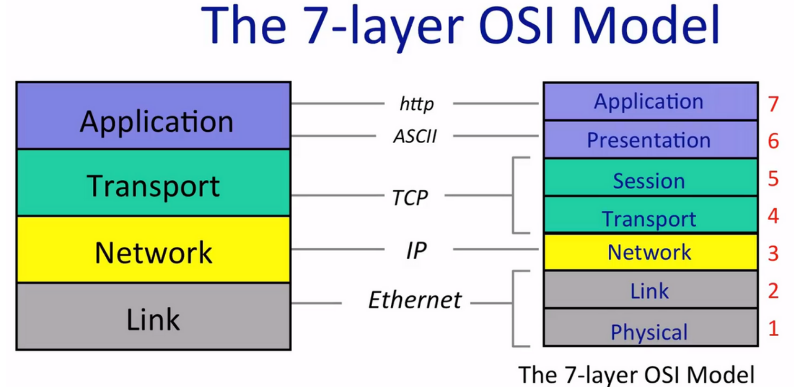

## The IP Service

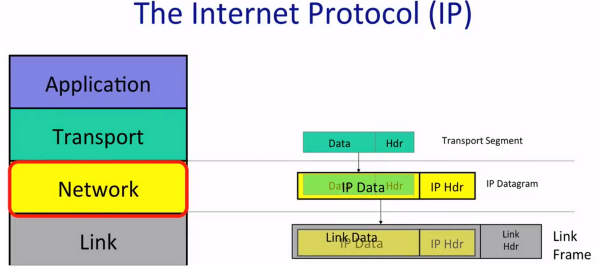

**The IP service model**:

In which the packet jumps among the routers (in which there are routing tables) in the path towards its destination. Routers in the path don't know its destination but the each other of themselves.

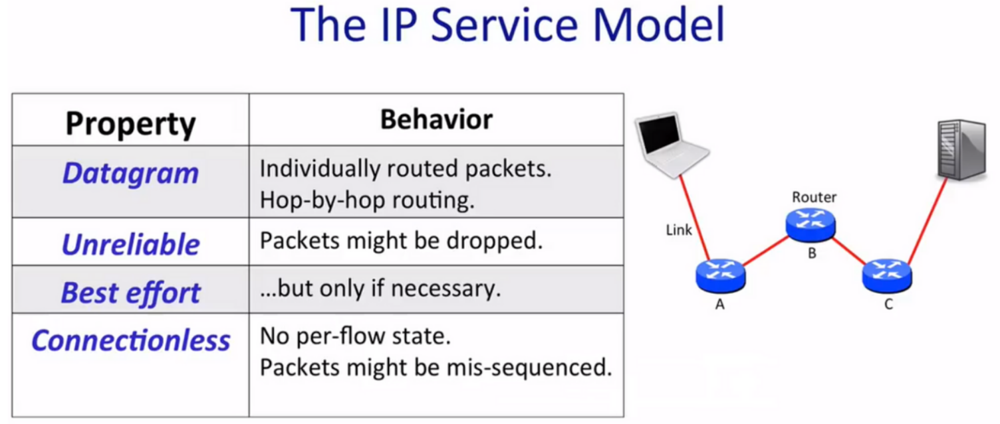

**The reasons for IP being so simple:**

- Simple, dumb, minimal = faster, more streamlined and lower cost to build and maintain.
- The end-to-end principle: Implement features in the end hosts as much as possible.
- Allows a variety of dependable/unreliable services to be built on top.
- Works over any link layer: IP makes few assumptions about the link layer below.

**More features of IP service model:**

1. Tries to prevent packets looping forever.
2. Will fragment packets if they are too long.
3. Use a header **checksum** to reduce chances of delivering datagram to wrong destination.
4. Allow for new versions of IP
   - IPv4 with 32-bit address
   - IPv6 with 128-bit address
5. Allow for new options to be added to header.

### What’s in a Datagram

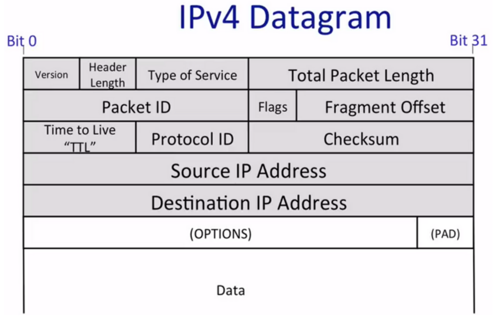

- Header is 32 bits or 4 bytes long

- The most important parts are **DA (Destination IP Address)** and **SA (Source IP Address)**.
- Protocol ID part tells what is in data field, helping destination host correctly process the packet.
- Version field tells the version of the IP.
- TTL part helps to stop the packet looping in the Internet. Every router will decrement the TTL till it reaches 0.
- The packet ID, Flags, Fragment Offset help router to fragment IP packet into smaller self-contained packets if needed.
- Type of Service tells the importance of the packet.
- Header Length tells how big the header is.
- Checksum is calculated over the whole header to make sure the packet to correct destination.

*Application Layer - stream of data*

*Transport Layer - segments of data (TCP segment)*

*Network Layer - packet of data (IP packet)*

*Link Layer - frame of data (Ethernet frame)*

In summary, IP provide a deliberately simple services:

- Datagram
- Unreliable
- Best-effort
- Connectionless

## Life of a Packet

### TCP Byte Stream

**Three-way handshake: *“SYN, SYN/ACK, ACK”***

*form Client to Server:* Send a synchronized message, ***“SYN”***

*from Server to Client:* Response a synchronized message and acknowledges the client’s synchronized, ***“SYN/ACK”***

*from Client to Server:* Acknowledge server’s synchronize, ***“ACK”***

### Inside the Stream

*Address format:* **IPAddress:TCPPort** (e.g., **192.168.0.1:22**)

Above is how a normal address looks like, IP address in Network Layer and TCP port in Transport Layer.

**A forwarding table in a router:**

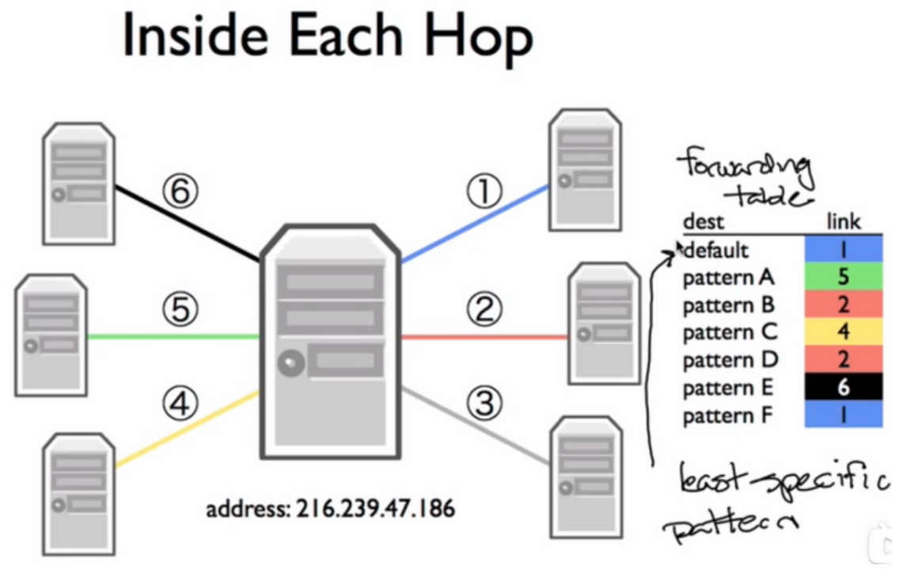

The router will send the packet to the matched entry pattern, which is the ***most specific*** match. ***This is called Longest Prefix Match!***

The default route is the least specific route, matches every IP address.

### The tools

**Wireshark:** Show all the packets, TCP byte stream establishment and data exchange

**Traceroute:** Shows the route (all the routers it passed) that the packet took through Internet

## Principle: Packet Switching

**Packet:** A self-contained <u>unit of data</u> that carries necessary <u>info</u>rmation to reach <u>destination</u>.

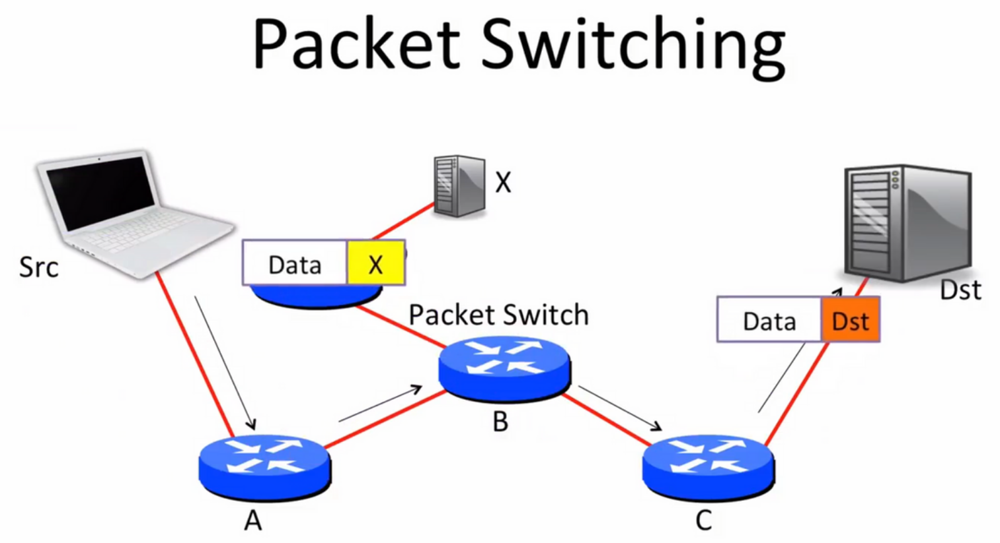

The packet will be routed between routers until it reached destination.

**Packet switching:** Independently for each arriving packet, pick its outgoing link. Send it if the link is free, else hold it for later.

Source routing/self-routing: The source specifies the route. (Not currently common for its big security issues)

Nowadays we use the route table that in each switch, according to which the switch can tell the packet to destination goes to right next hop.

Two consequences:

- Simple packet forwarding
- Efficient sharing of links

### No per-flow State Required: Simple Packet Forwarding

**Flow:** A collection of datagrams belonging to the same end-to-end communication, such as a TCP connection.

Packet switching don’t need state for each flow, since each packet is self-contained.

- No per-flow state to be added/removed
- No per-slow state to be stored
- No per-flow state to be changed upon failure

In one word, packet switching cares only about switching, do not deal with other issues!

### Efficient Sharing of Links

*\*bursty: Occurring at intervals in short, sudden episodes\**

Data traffic is bursty

- Packet switching allows flows to use all available link capacity.
- Packet switching allows flows to share link capacity.

## Principle: Layering

### Definition

> Layers are separate, functional components, that are hierarchical and communicating sequentially with its direct neighbours, above or below. Each layer provides service to the layer above, using the services from the layers below and its own processing. 

A good example of layering is **postal or express service**. 

> ​    	**sender** >> postman >> local site >> regional centre (near to sender) >>
>
> ​		**receiver** << postman << local site << regional centre (near to receiver)

In the above, each layer is separated, and does not care about how other layers work apart from its neighbouring layers. Also, they do not affect each other.

### Reasons for Layering

#### It helps

- Separation of concerns and responsibilities
- Allows each service to evolve independently

#### Summary

1. Modularity
2. Well defined service
3. Reuse
4. Separation of concerns
5. Continuous improvement

## Principle: Encapsulation

### Definition

Encapsulation is a principle that helpful to maintain layering.

It contributes to

- Different protocol layers sharing storage with in the same packet

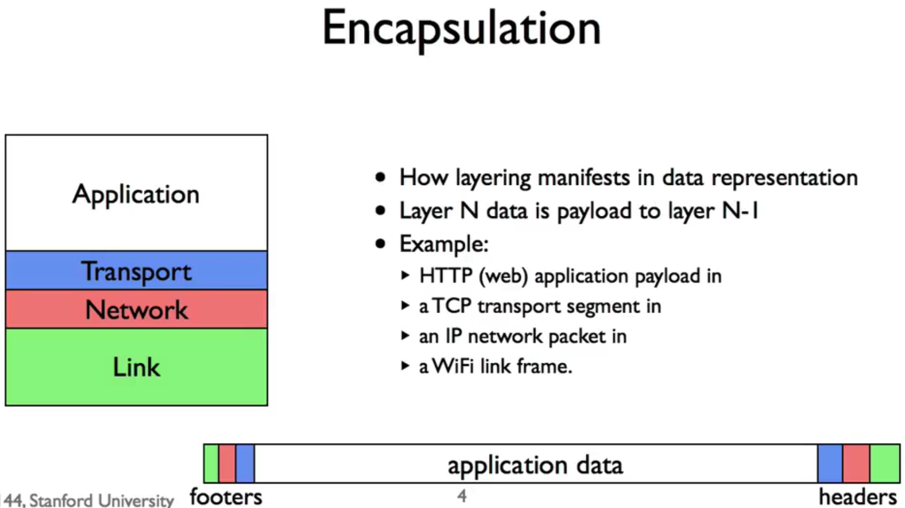

As the figure shows, e.g., a data in a layer is encapsulated as the payload of a data in the next layer .

*Note: The order of headers and footers depends on software side (headers-footers) or hardware side (footers-headers).*

### Encapsulation Flexibility

- Encapsulation allows layer recursively

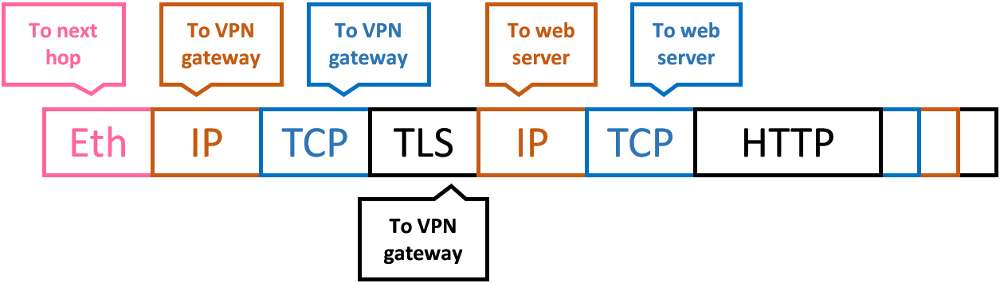

- Virtual Private Network (VPN)
  - HTTP application payload in
  - a TCP transport segment in 
  - an IP network packet in
  - a secured TLS presentation message in 
  - a TCP transport segment in 
  - an IP network packet in 
  - an Ethernet link frame

### Reason for Encapsulation

- Encapsulation is how layering manifests in data representation
- Encapsulated payloads
  - help separation of concerns
  - help enforce boundaries/layering
  - simplify layer implementations

## Memory, Byte Order, and Packet Formats

A memory of 8 GB is a huge chunk of bits from position 0x0000000000 to position 0x0200000000, which indicates 8 GB.

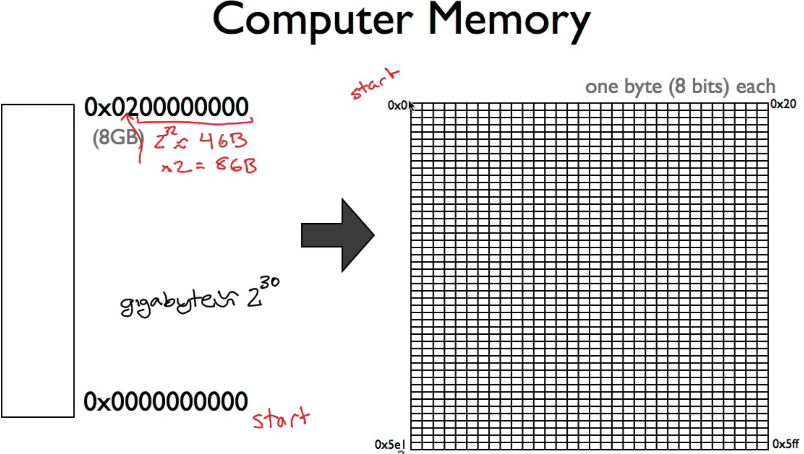

### Endianness

is how you arrange a multibyte value in memory

#### Two types of endianness:

- **Little Endian**: The least significant byte is at the lowest address (comes first)
  - Standing on the addressing/computational point 
- **Big Endian**: The most significant byte comes first
  - From a perspective from human reading

***It is necessary to understand this quiz thoroughly:***

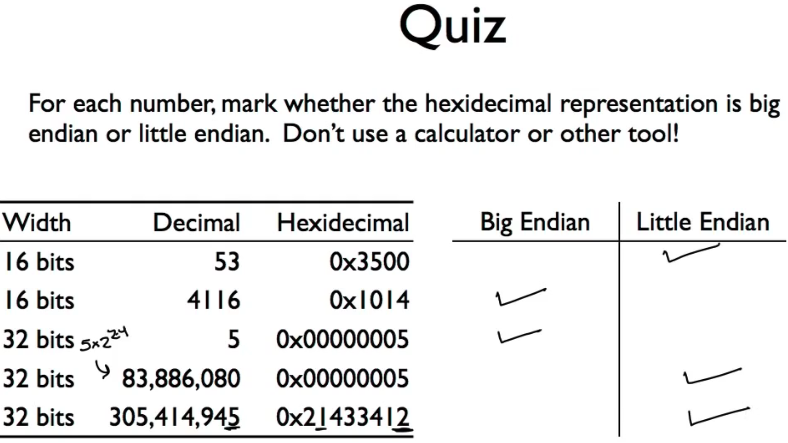

### Network Byte Order

- Endianness vary according to the platforms
  - ARM processors use big endian, x86 processors use little endian
- Network byte order is big endian

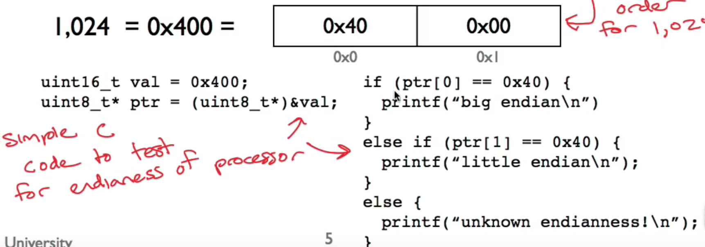

### Portable Code

- Necessary to convert byte order values to host order

- E.g., packet has a 16-bit port in network byte order, when using a struct to access it, to check on the x86 processor if the port is 80

  ```c
  uint16_t http_port = 80; //Host order
  If (packet->port == http_port){...//Network vs. host order; 0x00 0x50 (network) != 0x50 0x00 (host)
  ```

- Helper  functions: htons(), ntohs(), htonl(), ntohl()

  - ntohs: host to network short; ntohl: network to host long

  - ```c
    #include <arpa/inet.h>
    
    uint_t http_port = 80; //Host order
    uint16_t packet_port = ntohs(packet->port);
    if (packet_port == http_port){....//Works this way
    ```

- **so it is greatly import to be careful when handling network data (convertion)**

## Names and Addresses: IPv4

Routers decide which link to forward a packet over based on the packet's DA

**Goal of IP addr:** Switch many different networks together, which needs network-independent , unique addr

### Address Format

- One addr identifies a device on the Internet, on Network (3rd) Layer
- 32 bits long, separated to 4 octets: **a.b.c.d**
- Netmask: apply this mask, if the mask is the same as an addr, in the same network. It defines how the addr is cut into two parts (network+host)
  - e.g., 255.255.255.0 means if the first 24 bits ( first 3 octets) of two addrs match, the two in the same network
  - e.g., netmask 255.255.255.0 means 11111111.11111111.11111111.00000000
  - Smaller netmask (fewer 1s) means larger network

### Historical Address Structure

**network + host**, in which,

- Network to get to correct network
- Host to get to correct device in that network

3 classes of network: class A, class B, class C 

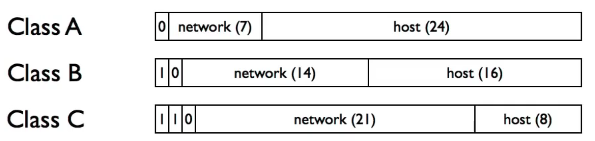

### Today's Address Structure

**Classless Inter-Domain Routing (CIDR)**

- Addr block is a pair: *addr/count*

- Counts are powers of 2 (count/2=nR0), specify netmask length

- 192.168.0.0/16 means the first 16 digits of the 32 digits are network addr, and the other 9 digits are host addr
- A/24 has 256 addrs, A/20 has 4,096 addrs

### IPv4 Address Assignment

ICANN (Internet Corporation for Assignment of Names and Numbers) is responsible for IANA (Internet Assigned Numbers Authority)

## Longest Prefix Match

